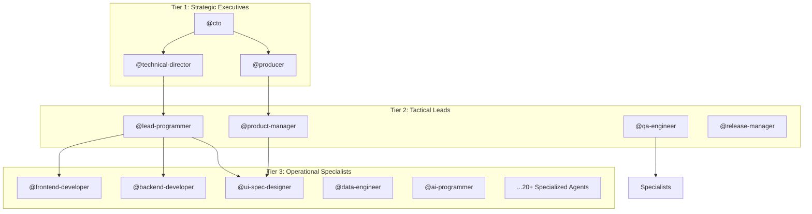
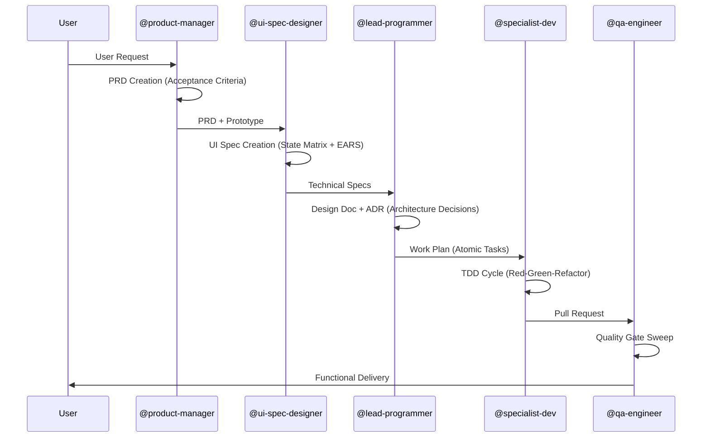

# SDD Project Architecture: Steel Discipline

This document defines the high-level architecture of the **Software Development Department (SDD)** project, a tiered, agentic system designed for high-precision software delivery.

## 1. Governance Model: Three-Tier Hierarchy

The SDD operates on a military-grade hierarchy where authority and responsibility are clearly delineated.

## 2. Document & Development Lifecycle (DLM)

The "Steel Discipline" ensures that no code is written without a rigorous document trail.

## 3. Modular System Architecture

The codebase is organized into specialized domain modules to minimize coupling and maximize parallelize development.

| Module | Responsibility | Core Technologies |
|--------|----------------|-------------------|
| `src/api` | Central communication hub & gateway | [Not Configured] |
| `src/frontend` | Client-side logic & state | [React / Vue / Angular] |
| `src/backend` | Business logic & persistence | [Express / FastAPI / Rails] |
| `src/ai` | Agent orchestration & LLM logic | [Gemini API / LangChain] |
| `src/ui` | Shared design system & components | [Vanilla CSS / Tailwind] |
| `src/tools` | DX, automation, and internal CLI | [Node.js / Bash] |

## 4. Cross-Cutting Capabilities (Skills)

These are the "Superpowers" shared across the department:

- **`/tdd`**: Test-Driven Development enforcement.
- **`/context`**: Context Engineering & Memory management.
- **`/diagnose`**: Three-stage deep bug diagnosis (Investigator -> Verifier -> Solver).
- **`/vertical-slice`**: End-to-end functional delivery pattern.
- **`/ui-spec`**: Bridge between design and implementation.

## 5. Deployment & Release

- **Steel Discipline Deployment**: Automated CI/CD with mandatory quality gates.
- **Rollback First**: Any failure in production triggers an immediate, automated rollback before investigation begins.
